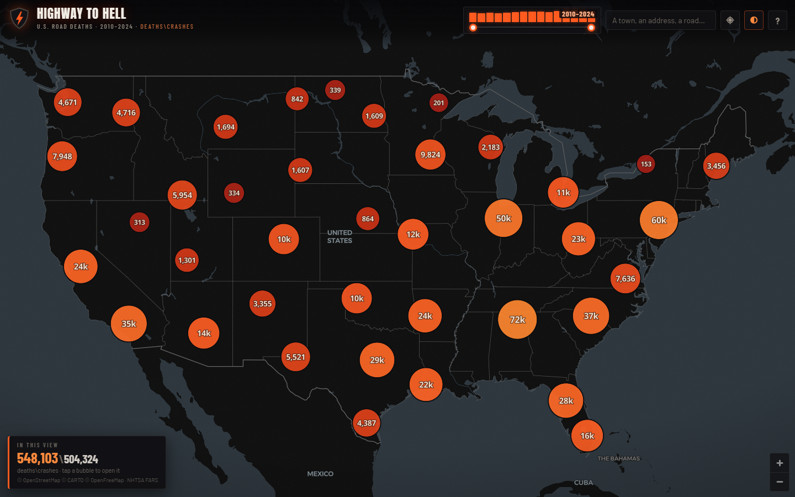

# Highway to Hell

Every fatal crash on American roads, 2010–2024, from NHTSA's
[Fatality Analysis Reporting System](https://www.nhtsa.gov/research-data/fatality-analysis-reporting-system-fars).

Tap a bubble to open it, keep drilling down to single crashes, tap a dot for the
full record. Static site; rebuild data with `python scripts/build_data.py`.

Data: NHTSA FARS, public domain. Basemaps © OpenStreetMap contributors, © CARTO,
© OpenFreeMap. Renderer: MapLibre GL JS (BSD-3-Clause). Not affiliated with
NHTSA or USDOT.
