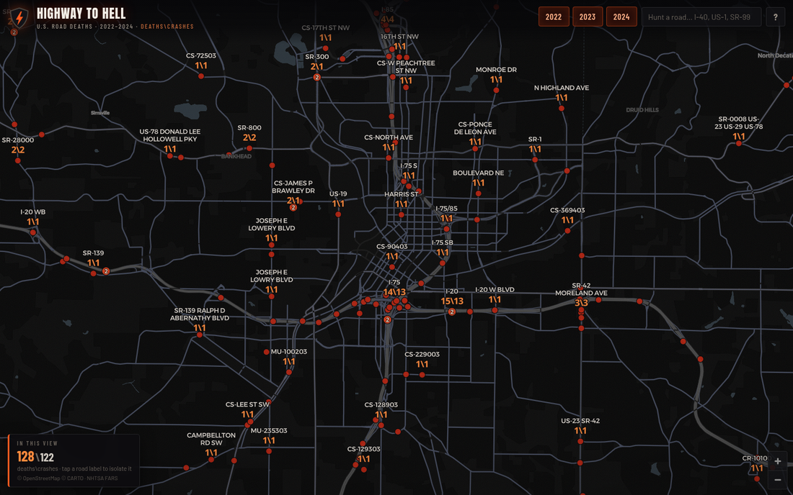
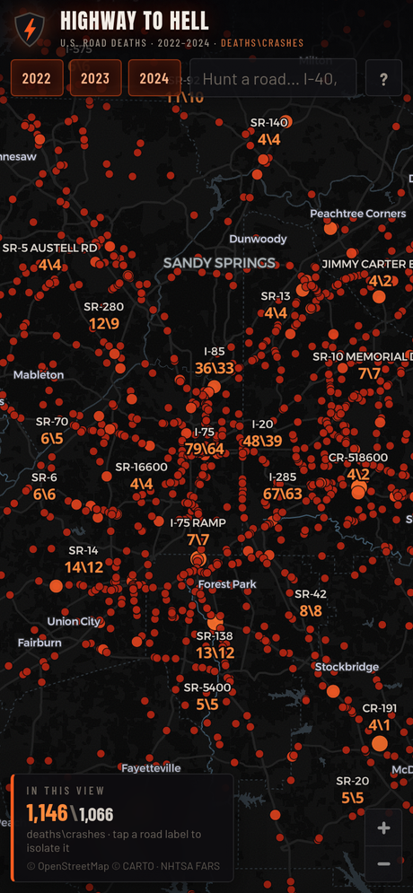

# Highway to Hell

**Every fatal crash in America, 2022–2024. Every road wears its toll.**

A single-page map of the 122,450 people killed in 112,975 motor-vehicle crashes
recorded by NHTSA's [Fatality Analysis Reporting System (FARS)](https://www.nhtsa.gov/research-data/fatality-analysis-reporting-system-fars).
Zoomed out it's a heat field; mid-zoom circles total the deaths inside them; zoomed in,
every named road shows **deaths\crashes** for the current view, every dot is a crash,
and tapping a road label isolates that road nationwide.


| Street level — every road numbered | Mobile |
| --- | --- |
|  |  |

## How it works

Pure static site — no backend, no build step, no API keys. Ready for GitHub Pages.

- **Data** — `data/fars.json` (4.4 MB raw, ~1.3 MB gzipped over the wire) is a
  column-oriented pack of all 112,975 crashes: quantized lat/lon, deaths, year,
  month, road-name index, state index. Built from the FARS *National CSV*
  `accident.csv` files by `scripts/build_data.py`.
- **Map** — [MapLibre GL JS](https://maplibre.org) (vendored, `assets/vendor/`)
  over CARTO's Dark Matter basemap. The style JSON and all glyph files are
  self-hosted, so the crash layers, numbers, and road labels render even if the
  tile CDN is unreachable — only basemap tiles come from CARTO at runtime.
- **Road numbers** — crashes are grouped by the FARS trafficway identifier
  (`TWAY_ID`, lightly cleaned of state inventory codes). On every map move the
  viewport's crashes are re-aggregated per road and the top roads get a
  `deaths\crashes` label anchored to the crash nearest the group's centroid, so
  labels sit on the road itself.
- **Search** — type a road (`I-40`, `US-1`, `SR-99`) to see its national toll and
  isolate its crashes on the map. Year chips re-filter everything live.

## Deploying on GitHub Pages

Two options:

1. **Deploy from branch** (simplest): repo *Settings → Pages → Source: Deploy from
   a branch*, pick the default branch and `/ (root)`. Done.
2. **GitHub Actions**: *Settings → Pages → Source: GitHub Actions*. The included
   workflow (`.github/workflows/deploy.yml`) publishes the site on every push.

Everything is path-relative, so it works at `https://<user>.github.io/<repo>/`.

## Refreshing the data

When NHTSA publishes a new FARS year (annual file lands ~18 months after
year-end):

```bash
python3 scripts/build_data.py --years 2023 2024 2025
```

The script downloads `FARS<year>NationalCSV.zip` from `static.nhtsa.gov` (cached
in `.cache/fars/`), keeps crashes with usable coordinates, and rewrites
`data/fars.json`. Update the year range shown in `index.html` if it changes.
`scripts/build_states.py` regenerates the state-outline fallback layer from
[us-atlas](https://github.com/topojson/us-atlas).

## Reading the numbers honestly

- FARS counts deaths within 30 days of a public-road crash — the federal
  definition of a traffic fatality.
- Road names are whatever each state reported. The same highway can appear under
  several names ("I-40", "I-40 E", "I-40/OLD ROUTE 66"), and a road crossing
  state lines counts each state's stretch under the same name.
- 513 crashes (0.5%) with unknown coordinates are excluded from the map but not
  from FARS's official totals.
- More deaths on a road usually means more traffic, not necessarily more danger
  per mile. This map shows *where people died*, not a per-mile risk ranking.

## Credits & licenses

- Crash data: NHTSA FARS — US Government work, public domain.
- Basemap: © [OpenStreetMap](https://www.openstreetmap.org/copyright)
  contributors, © [CARTO](https://carto.com/attributions) (Dark Matter style).
- Renderer: MapLibre GL JS, BSD-3-Clause (`assets/vendor/MAPLIBRE-LICENSE.txt`).
- Fonts: Anton, Barlow, Barlow Condensed (SIL OFL, self-hosted); map glyphs
  Montserrat, Open Sans, Noto Sans (SIL OFL / Apache-2.0).

Not affiliated with NHTSA or USDOT. Every number here was somebody — drive like it.
