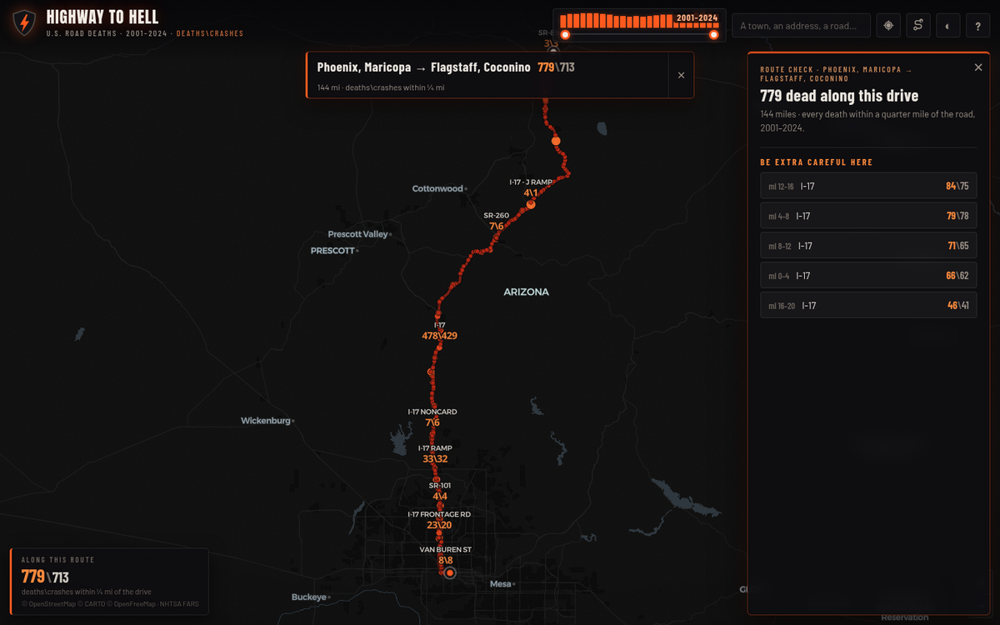

# Highway to Hell

**Every fatal crash on American roads with a known location, 2001–2024. Every road wears its toll.**

A single-page map of the **898,888 people killed in 821,145 crashes** recorded by NHTSA's
[Fatality Analysis Reporting System (FARS)](https://www.nhtsa.gov/research-data/fatality-analysis-reporting-system-fars).
Zoomed out it's a heat field; inside a state every named road shows **deaths\crashes**
for the view, every dot is a crash, and tapping a dot opens the full case file —
date and time, conditions, every vehicle, every person.


## What it does

- **The national burn** — a pre-binned heat field of all 24 years, filterable by
  year range with the histogram slider (bars are deaths per year).
- **One state at a time** — zooming into a state lazy-loads its crash pack, so the
  map stays fast; roads re-aggregate their `deaths\crashes` labels on every move.
- **The full record** — tap a crash for the FARS case file: conditions, harmful
  event, each vehicle (year/make/model, speed, rollover, fire, hit-and-run), each
  person (age, role, restraint, ejection, outcome). Older years show what the era's
  coding supports.
- **Your corner** — search a place or hit the crosshair: a draggable pin with a
  1/3/5/10-mile ring scopes everything to it. Pin and radius live in the URL and
  localStorage.
- **Route check** — give it a drive (A → B): it pulls the route from the open
  [OSRM](http://project-osrm.org) router, counts every death within a quarter mile
  of the road, colors the route by how deadly each stretch has been, and lists the
  stretches where you should be extra careful.

  
- **Roads nationally** — the search box also finds roads; picking one isolates its
  crashes coast to coast (`I-40` → its whole 24-year toll).
- **Two basemaps** — CARTO Dark Matter by default, an OpenFreeMap street style (◐)
  when you need names and buildings.

## How it works

Pure static site — no backend, no build step, no API keys. GitHub Pages serves it.

| piece | file(s) | size |
| --- | --- | --- |
| National heat grid + meta | `data/boot.json` | ~5 MB (≈1.6 MB gzipped) |
| Per-state crash packs | `data/s/<fips>.json` | 30 MB total, lazy-loaded |
| Road search index | `data/roads.json` | ~5 MB, lazy-loaded |
| Per-crash case files | `data/d/<year>_<fips>.json` | 173 MB total, loaded per tap |

The frontend (MapLibre GL, vendored) never builds large feature sets synchronously —
state packs hydrate in time-sliced chunks, so the UI thread never freezes, verified
with CPU-throttled mobile runs. The basemap style, glyphs, and fonts are self-hosted;
only basemap tiles, place search ([Photon](https://photon.komoot.io)), and route
requests (OSRM) leave the site at runtime.

## Rebuilding the data

```bash
python3 scripts/build_data.py            # 2001–2024, downloads FARS zips as needed
```

`scripts/build_data.py` reads the FARS National CSV `accident`, `vehicle`, and
`person` files per year (cached in `.cache/fars/`), harvests code→label mappings
from the modern files to back-fill labels for older years, gates fields whose codes
were renumbered (WEATHER and MAN_COLL in 2010, old two-digit speeds), cleans state
roadway-inventory noise out of road names, and writes the boot grid, state packs,
road index, and detail shards. `scripts/build_states.py` regenerates the state
outlines.

Coordinates exist in FARS from 2001 (81.6% coverage that year, ≥92% from 2002,
≈99.5% in recent years); 1999–2000 have none, which is why the map starts at 2001.
22,385 crashes (2.7%) with unusable coordinates are excluded from the map.

## Reading the numbers honestly

- FARS counts deaths within 30 days of a public-road crash — the federal definition.
- Road names are whatever each state reported; the same highway can appear under
  several names, and a road crossing state lines counts each state's stretch.
- More deaths on a road usually means more traffic, not necessarily more danger per
  mile. The route check shows where people died along your drive, not a per-mile
  risk ranking.

## Credits & licenses

- Crash data: NHTSA FARS — US Government work, public domain.
- Basemaps: © [OpenStreetMap](https://www.openstreetmap.org/copyright) contributors,
  © [CARTO](https://carto.com/attributions) (Dark Matter),
  © [OpenFreeMap](https://openfreemap.org) (Liberty).
- Routing: [OSRM](http://project-osrm.org) demo server. Geocoding:
  [Photon](https://photon.komoot.io) by komoot.
- Renderer: MapLibre GL JS, BSD-3-Clause (`assets/vendor/MAPLIBRE-LICENSE.txt`).
- Fonts: Anton, Barlow, Barlow Condensed (SIL OFL, self-hosted); map glyphs
  Montserrat, Open Sans, Noto Sans (SIL OFL / Apache-2.0).

Not affiliated with NHTSA or USDOT. Every number here was somebody — drive like it.
